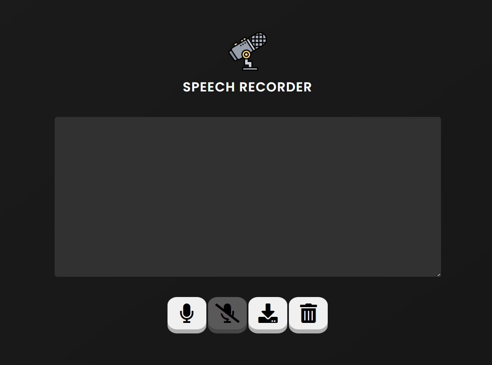

# Speech Recognition for Web

This project enables voice transcription directly through your browser's microphone, with an option to download the transcribed text file. It is built using the Web Triad: HTML, CSS, and JavaScript.



## Features

- **Real-time Speech Recognition:** Transcribes spoken words into text in real-time.
- **Download Transcription:** Allows users to download the transcribed text as a file.
- **User-friendly Interface:** Simple and intuitive interface for easy use.
- **Cross-Browser Compatibility:** Works on most modern web browsers.

## Technologies Used

- **HTML:** Structure of the web application.
- **CSS:** Styling and layout of the application.
- **JavaScript:** Core functionality for speech recognition and file handling.

## How to Use

1. **Clone the Repository:**
    ```bash
    git clone https://github.com/yourusername/speech-recognition-for-web.git
    ```
2. **Navigate to the Project Directory:**
    ```bash
    cd speech-recognition-for-web
    ```
3. **Open in your Web Browser.**
4. **Allow Microphone Access:** Grant the necessary permissions when prompted by your browser.
5. **Start Speaking:** Click on the "Start" button to begin transcription.
6. **Download Transcription:** Click on the "Download" button to save the transcribed text as a file.

## Contributing

Contributions are welcome! Please fork this repository and submit a pull request with your improvements.

## License

This project is licensed under the MIT License. See the [LICENSE](LICENSE) file for details.